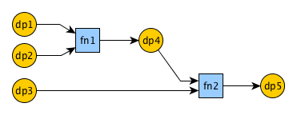

# Simple Programmable Function Grid

[](https://circleci.com/gh/ccortezia/spfg/tree/master)
[](https://codecov.io/gh/ccortezia/spfg)

SPFG is a minimalistic stateful event processor library meant as a foundational block to higher level event-driven rule engines.

It is compliant to a range of platforms, from embedded devices all the way to modern browsers through WebAssembly. The core library is written in C with no external dependencies other than libc, with the goals of having predictable memory usage and binary footprint. Bindings for higher level languages are provided under `contrib`, and a predictable schemaful malloc-free JSON deserializer is provided under `lib/azjson` to allow for safe cross-platform propagation of metadata.

**Disclaimer**: *the first stable version hasn't yet been released, so the public interface (and the library name) may still change.*

## Build

To build for x86, run:

```shell
make
```

To build for a specific architecture use the make variable ARCH:

```shell
make ARCH=x86_64
make ARCH=arm
make ARCH=atmega328
make ARCH=atmega168
```

To build for WebAssembly, run:

```shell
make ARCH=wasm CC=emcc
```

To build using docker:

```shell
docker run -ti --rm -v$(pwd):/opt/proj -w /opt/proj ccortezia/spfg_build:0.2 make
```

Some convenience targets:

```shell
make devel   # Builds, runs tests, removes intermediate build artifacts.
make clean   # Removes all built artifacts.
make ci      # Builds, runs tests, captures coverage, build coverage report.
```

- Refer to the [Makefile](Makefile) for additional top-level make targets.
- Refer to the [CI Dockerfile](.circleci/Dockerfile) for your specific list of build dependencies.
- Refer to the [CI description](.circleci/config.yml) for additional insight on build options.


## Abstraction Model

The relevant abstraction units in the library are `grid`, `function` and `datapoint`.

A `datapoint` holds a piece of typed memory in addition to metadata to allow for easy inspection of its recent mutation history. A `datapoint` instance is bound to work with a single type, which has to be one of `boolean`, `integer`, `real`,  or `string`. A `datapoint` can be the input of at most one function. A `datapoint` can be the output of at most one function.

A `function` is associated to one or more input `datapoint` instances and also to one or more output `datapoint` instances. When evaluated it will consume its inputs and update its outputs if necessary.

A `grid` contains a graph where nodes are `function` and `datapoint` instances, and edges are their relationships. The `grid` evaluation causes the graph the be traversed and `function` instances to be processed according to their related inputs and outputs until all changed data is properly consumed. A `grid` is divided in sequential phases, and a `function` instance can only exist in a single phase. The graph traversal strategy is breadth-first per phase.

## Getting Started

With the abstraction model above in mind, consider the following grid where all datapoints are of type `boolean`, and both functions are simple AND operators:



The code to create such `grid` and then trigger its evaluation using the core API would be as follows (error handling omitted for brevity):

```c
#include <assert.h>
#include "spfg/spfg.h"


void spfg_example_1() {

    spfg_gr_id_t gr1;
    spfg_fn_id_t fn1;
    spfg_fn_id_t fn2;
    spfg_dp_id_t dp1;
    spfg_dp_id_t dp2;
    spfg_dp_id_t dp3;
    spfg_dp_id_t dp4;
    spfg_dp_id_t dp5;

    // Allocates datapoint instances.
    spfg_gr_create("gr1", &gr1);
    spfg_dp_create(gr1, SPFG_DP_BOOL, "dp1", &dp1);
    spfg_dp_create(gr1, SPFG_DP_BOOL, "dp2", &dp2);
    spfg_dp_create(gr1, SPFG_DP_BOOL, "dp3", &dp3);
    spfg_dp_create(gr1, SPFG_DP_BOOL, "dp4", &dp4);
    spfg_dp_create(gr1, SPFG_DP_BOOL, "dp5", &dp5);

    // Allocates function instance.
    spfg_fn_type_t fn1_type = SPFG_FN_AND_BOOL_BOOL_RET_BOOL;
    spfg_phase_t fn1_phase = 0;
    spfg_dp_id_t fn1_in_dps[] = {dp1, dp2};
    spfg_dp_id_t fn1_out_dps[] = {dp4};
    spfg_fn_create(gr1, fn1_type, fn1_phase, fn1_in_dps, 2, fn1_out_dps, 1, "fn1", &fn1);

    // Allocates function instance.
    spfg_fn_type_t fn2_type = SPFG_FN_AND_BOOL_BOOL_RET_BOOL;
    spfg_phase_t fn2_phase = 1;
    spfg_dp_id_t fn2_in_dps[] = {dp4, dp3};
    spfg_dp_id_t fn2_out_dps[] = {dp5};
    spfg_fn_create(gr1, fn2_type, fn2_phase, fn2_in_dps, 2, fn2_out_dps, 1, "fn2", &fn2);

    // Updates some arbitrary input datapoint instances.
    spfg_dp_set_bool(gr1, dp1, true);
    spfg_dp_set_bool(gr1, dp2, true);
    spfg_dp_set_bool(gr1, dp3, true);

    // Triggers grid evaluation.
    spfg_reset_cycle(gr1);
    spfg_run_cycle(gr1, 0, NULL, NULL);

    // Verify data changes.
    spfg_dp_get_bool(gr1, dp5, &dp5_output, &dp5_emitted);
    assert(true == dp5_output);
    assert(true == dp5_emitted);
}
```

## Bindings

- **Javascript**: A shin javascript wrapper is provided to interact with the native library compiled to WebAssembly.
- **Elm**: Elm type definitions and JSON encoders/decoders are provided. Driving the wasm lib relies on Elm ports.
- **Python**: A specific python binding hasn't yet been developed. For now, use ctypes to drive the ABI.

## Roadmap

- Add support for object reference driven API, as opposed to current object id driven.
- Add compile flags to optimize binary footprint.
- Support optional error stack to core library.
- Support optional error stack to azjson.
- Add extensive test coverage to the core library through pytest.
- Add extensive test coverage to azjson through pytest.
- Support of all announced types (real, integer, string are still missing)
- Support more basic functions, including timestamp stream oriented filters.
- Complete richer graph viewer under contrib/elm.
- Add more usage examples as the library gets to a more complete state.
